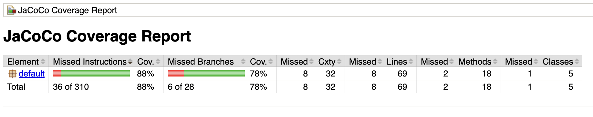

# Magical Arena Game

This project implements a simple magical arena game where two players fight until one player's health reaches zero. Each player has health, strength, and attack attributes, and they attack and defend in turns using dice rolls.

## Project Structure
```
MagicalArenaGame/
│
├── lib/
│ ├── junit-jupiter-api-5.7.0.jar
│ ├── junit-jupiter-engine-5.7.0.jar
│ ├── apiguardian-api-1.1.0.jar
│ ├── opentest4j-1.2.0.jar
│ ├── junit-platform-commons-1.7.0.jar
│ ├── junit-platform-engine-1.7.0.jar
│ └── junit-platform-console-standalone-1.11.0-M2.jar
│
├── images/
│ ├── complie.png
│ ├── generate_report.png
│ ├── run_main.png
│ ├── run_tests.png
│ └── test_coverage.png
│
├── src/
│ ├── Player.java
│ ├── Arena.java
│ └── MagicalArenaGame.java
│
├── test/
│ ├── PlayerTest.java
│ └── ArenaTest.java
│
├── bin/ (generated after compilation)
│
├── report/ (generated after generating report)
│
├── jacoco.exec (generated after generating report)
│
├── README.md
└── .gitignore
```

## Prerequisites

- Java Development Kit (JDK) installed (version 8 or above)
- JUnit 5 JAR files (`junit-jupiter-api-5.7.0.jar`, `junit-jupiter-engine-5.7.0.jar`, `apiguardian-api-1.1.0.jar`, `opentest4j-1.2.0.jar`, `junit-platform-commons-1.7.0.jar`, `junit-platform-engine-1.7.0.jar`)
- JUnit Platform Console Standalone JAR (`junit-platform-console-standalone-1.11.0-M2.jar`)
- JaCoCo Platform JAR Files (`jacocoagent.jar`, `jacococli.jar`)

## Setting Up the Project

1. **Download JUnit 5 JAR Files:**

    Download the following JAR files from the official JUnit 5 repository and place them in the `lib` directory of your project:

    - `junit-jupiter-api-5.7.0.jar`
    - `junit-jupiter-engine-5.7.0.jar`
    - `apiguardian-api-1.1.0.jar`
    - `opentest4j-1.2.0.jar`
    - `junit-platform-commons-1.7.0.jar`
    - `junit-platform-engine-1.7.0.jar`

2. **Download and Extract JUnit Platform Console Standalone:**

    Download `junit-platform-console-standalone-1.11.0-M2.jar` from the official JUnit 5 repository and place it in the `lib` directory of your project.

3. **Download and Extract JaCoCo Jar Files:**

    Download the following JAR files from the official JaCoCo repository and place them in the `lib` directory of your project:

    - `jacocoagent.jar`
    - `jacococli.jar`

4. **Compile the Source and Test Files:**

    Open a terminal and navigate to the project directory. Compile the source files using the following command:

    ```bash
    javac -cp "lib/*" -d bin src/*.java test/*.java
    ```
    
5. **Run the Main Application:**

    To run the main application, use the following command:

    ```bash
    java -cp bin MagicalArenaGame
    ```
    

6. **Run the Tests:**

    To run the tests, use the JUnit Platform Console Standalone JAR:

    ```bash
    java -javaagent:lib/jacocoagent.jar=destfile=jacoco.exec -cp "bin:lib/junit-platform-console-standalone-1.11.0-M2.jar:lib/*" org.junit.platform.console.ConsoleLauncher --scan-class-path --include-engine=junit-jupiter
    ```
    

7. **Generate the Report:**

    To generate the report, use the jacococli.jar file:

    ```bash
    java -jar lib/jacococli.jar report jacoco.exec --classfiles bin --html report
    ```
    
    Report generated
    
## Detailed Explanation of Classes

### Player.java

This class represents a player in the arena with attributes for health, strength, and attack. It includes methods for rolling the dice, checking if the player is alive, and adjusting the player's health.

### Arena.java

This class manages the battle between two players. It handles the logic for turns, calculating damage, and determining the winner.

### MagicalArenaGame.java

This is the main class that sets up the players and the arena and starts the battle.

### PlayerTest.java

This class contains unit tests for the `Player` class using JUnit 5.

### ArenaTest.java

This class contains unit tests for the `Arena` class using JUnit 5.

## .gitignore

The `.gitignore` file includes entries to ignore the `bin`, `lib` and `report` directories and any other files that should not be committed to version control.

## Notes

- Ensure you have the correct version of the JDK installed.
- Place the necessary JUnit JAR files in the `lib` directory.
- Follow the steps in this README to compile, run, and test the project.
- To view the report. Go inside the report folder after generating the reports and check the index.html file

Happy coding!

